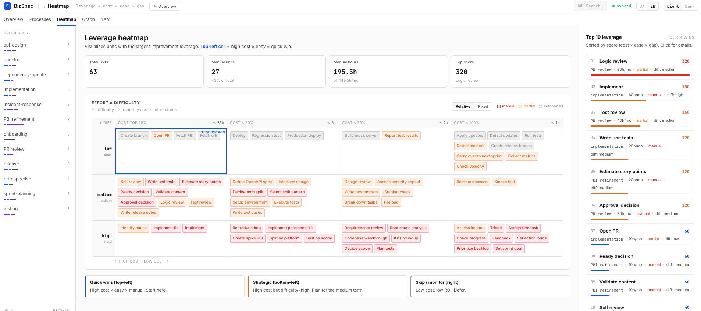
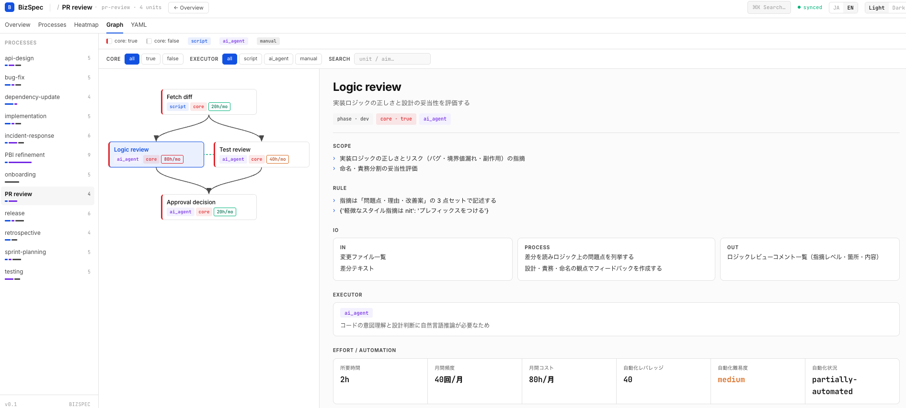
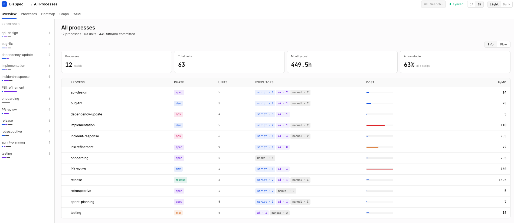

# BizSpec

> AI エージェントが実行できる粒度まで業務プロセスを YAML で記述する

[](https://github.com/y-hirakaw/BizSpec/actions/workflows/test.yml)


[English](README.md) | 日本語

> **試作中です。** 初期の実験的な段階にあります。API やファイルフォーマットは変更される可能性があります。

**BizSpec** は業務プロセスを最小実行単位（YAML）に分解し、各ステップを `script` / `ai_agent` / `manual` で分類して、フローを HTML で可視化する CLI ツールです。Claude Code スキル（`/bizspec-refine`, `/bizspec-refactor`）と組み合わせて、AI が業務を直接リファクタできる形に整えます。



<details>
<summary>その他のビュー</summary>

<br>

**プロセス詳細** — 1 プロセスの DAG と、選択 unit の効果 (effort × frequency × difficulty)、IO、Scope、Rule。



**全プロセス概観** — KPI とプロセス横断テーブル。



</details>

## Quick start

```sh
git clone https://github.com/y-hirakaw/BizSpec.git
cd BizSpec
uv pip install -e .
bizspec init                      # Claude Code スキルをインストール
bizspec viz                       # bizspec/_viz/index.html を生成（同梱サンプル）
```

## Why BizSpec?

- **描くだけでなく実行する** — Mermaid や draw.io は描画ツール。BizSpec は executor / IPO / link を YAML で定義し、AI agent / script / human が実際に走らせる前提で設計します。
- **Git ネイティブ + AI でリファクタ可能** — YAML は diff・PR レビュー・grep が効きます。Claude Code Skills（`/bizspec-refine`, `/bizspec-refactor`）から AI が業務を直接リファクタできます。
- **コストを可視化** — `effort × frequency` のヒートマップで工程ごとの月間コストが viz に色で出ます。

## できること

- **スキルのインストール** — 対話形式で Claude Code スキルを `.claude/skills/` に配置（`bizspec init`）
- **分解** — `/bizspec-refine` スキルで業務プロセスを最小 unit に分解
- **リファクタリング** — `/bizspec-refactor` スキルで複数プロセスを横断分析
- **スケルトン生成** — `bizspec new`
- **検索 / 一覧 / 検証** — `bizspec search` / `list` / `validate`（`--format json` で CI 連携）
- **リネーム / 削除 / 採番** — `bizspec rename` / `rm` / `renumber`（link 参照を一括更新、フロー分断を事前検知）
- **可視化** — `bizspec viz` でクリッカブルな HTML フロー図を生成（プロセスごと + 全プロセス統合 `index.html`）

`bizspec/` には 2 つのサンプルが入っています：
- `issue-refinement/` — PBI リファインメントプロセス（9 unit）
- `pr-review/` — 分岐と合流を含む PR レビュープロセス（4 unit）

## ドキュメント

- [YAML スキーマリファレンス](docs/yaml-spec.md) — フィールド一覧、責務ルーブリック、判別ルール
- [CLI リファレンス](docs/cli.md) — 全コマンドのオプションと使用例

## ディレクトリ構成

```
bizspec/
  <プロセス名>/          # プロセスごとにフォルダ
    <unit名>.yaml        # unit ごとに 1 ファイル
  _viz/                  # 生成 HTML（bizspec viz の出力先）
    index.html           # 全プロセス統合ビュー
src/bizspec/
  core/                  # 共有レイヤー（loader / errors / model)
  viz/                   # bizspec viz 実装（layout / builder / cmd / templates）
  skills/                # パッケージ同梱スキル（bizspec init のコピー元・正本）
.claude/skills/          # Claude Code 用にコピーされたスキル
docs/
  yaml-spec.md
  cli.md
```

## コントリビューション

バグ報告・機能要望・PR を歓迎します。詳細は [CONTRIBUTING.md](CONTRIBUTING.md) を参照してください。

「good first issue」ラベルが付いた Issue から始めるのがおすすめです。

## ライセンス

MIT License — 詳細は [LICENSE](LICENSE) を参照。
